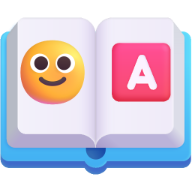

# Emoji Alphabet

**Welcome to the Emoji Alphabet!**

The Emoji Alphabet is an effort to create a standardized system where each letter of the Latin alphabet is represented by a distinct emoji. A unique aspect of our approach is the inclusion of a character for the space, making reading easier. The project also extends to include punctuation, numbers, and mathematical symbols, providing a complete emoji-based representation system.

To bring this concept to life, we offer a tool that allows you to transliterate your text into this Emoji Alphabet, transforming your words into a fun, emoji-filled version!

Additionally, we provide downloads of the Emoji Alphabet in various formats, including JSON, JavaScript, and plain text, as well as access to the source code on GitHub. For inspiration, we've also prepared samples from literature and poetry that showcase the creative possibilities of this unique alphabet.

This is an ongoing open project aiming to establish an inclusive community where all input is welcome. You can share suggestions, engage in discussions, and contribute to the project.

Explore, create, and share the joy of emoji-based expression!

## The Alphabet

| Letter | Emoji | Explanation |
|--------|-------|-------------|
| **A** | 🅰️ | The blood type A emoji includes an A |
| **B** | 🅱️ | The blood type B emoji includes a B |
| **C** | ©️ | Copyright symbol resembles the letter C |
| **D** | ▶️ | Play button emoji resembles a D |
| **E** | 📧 | Email emoji represents E |
| **F** | 🎏 | Fish flag resembles the upright bar and crossbar of F |
| **G** | 🌀 | Swirl emoji visually resembles a G |
| **H** | ♓ | Pisces symbol resembles an H |
| **I** | ℹ️ | Information symbol is a lowercase I |
| **J** | 🎷 | Saxophone has a curved J shape |
| **K** | 🔑 | Key starts with K |
| **L** | 🛴 | Scooter emoji resembles the letter L |
| **M** | Ⓜ️ | The circled M emoji contains an M |
| **N** | ♑ | Capricorn symbol resembles an N |
| **O** | 🅾️ | The blood type 0 emoji directly represents the letter O |
| **P** | 🅿️ | The parking emoji contains a P |
| **Q** | 🔍 | Magnifying glass resembles a Q |
| **R** | ®️ | Registered trademark symbol contains an R |
| **S** | 💲 | Dollar sign resembles an S |
| **T** | ✝️ | Cross symbol resembles a T |
| **U** | ⛎ | Ophiuchus symbol contains a U |
| **V** | ✔️ | Checkmark resembles a V |
| **W** | 〰️ | Wavy line resembles a W |
| **X** | ❌ | Cross mark directly resembles an X |
| **Y** | 🦞 | The lobster emoji resembles the letter Y |
| **Z** | 💤 | Zzz symbol for sleeping resembles the letter Z |
| **Space** | ⬜ | Empty white box for space |

| Symbol | Emoji | Explanation |
|--------|-------|-------------|
| **** | ▪️ | Full stop emoji |
| **,** | 🔻 | Comma emoji |
| **!** | ❗️ | Exclamation mark emoji |
| **?** | ❓ | Question mark emoji |
| **#** | #️⃣ | Hash/hashtag emoji |
| **\*** | *️⃣ | Asterisk emoji |

| Number | Emoji | Explanation |
|--------|-------|-------------|
| **0** | 0️⃣ | Zero emoji |
| **1** | 1️⃣ | One emoji |
| **2** | 2️⃣ | Two emoji |
| **3** | 3️⃣ | Three emoji |
| **4** | 4️⃣ | Four emoji |
| **5** | 5️⃣ | Five emoji |
| **6** | 6️⃣ | Six emoji |
| **7** | 7️⃣ | Seven emoji |
| **8** | 8️⃣ | Eight emoji |
| **9** | 9️⃣ | Nine emoji |

| Symbol | Emoji | Explanation |
|--------|-------|-------------|
| **+** | ➕ | Plus sign emoji |
| **-** | ➖ | Minus sign emoji |
| **÷** | ➗ | Division sign emoji |
| **=** | 🟰 | Equals sign emoji |
| **∞** | ♾️ | Infinity emoji |

## Selection and Design Principles

The selection of emoji for the Emoji Alphabet was guided by several key principles. First, if an emoji already represented the letter directly or clearly resembled the letter’s shape, it was chosen. For example, emoji with distinct and recognizable shapes were prioritized to ensure clarity and ease of identification. The goal was to pick emoji that had clear lines and a simple design, making them easy to distinguish, even at smaller sizes.

In cases where no emoji directly represented the letter or its shape, the next step was to find an object or symbol that could be associated with the letter. For example, for the letter "K," a key emoji was chosen due to the phonetic similarity between "key" and "K." This approach helped maintain a strong, logical connection between the letter and its corresponding emoji, ensuring that the system remained intuitive.

Color also played a role in the selection process. A key goal was to have most of the emoji feature similar colors—primarily red, blue, and purple—to maintain a sense of consistency across the alphabet. These colors were chosen for their visibility and the way they help create a visually cohesive system. By focusing on these hues, we aimed for a design that felt unified while still allowing each emoji to stand out clearly from the others.

Another key consideration was ensuring that the emoji selected were similar across all major vendors. Given that emoji can appear differently across platforms, it was important to choose symbols that were widely used and recognizable across all major operating systems and devices. This way, the Emoji Alphabet would remain usable and consistent for as many people as possible, regardless of the platform they were using.

It’s important to note that the choices made for the Emoji Alphabet are not final. Contributors are encouraged to suggest changes or improvements, allowing the system to evolve and become even more refined. This collaborative approach ensures that the Emoji Alphabet remains adaptable and open to new ideas and insights.

## Samples

### ©️🅰️🛴🛴⬜Ⓜ️📧⬜ℹ️💲♓Ⓜ️🅰️📧🛴▪️  

**"Call me Ishmael."**

From *Moby-Dick* by Herman Melville

### 〰️🅰️®️⬜ℹ️💲⬜🅿️📧🅰️©️📧▪️⬜🎏®️📧📧▶️🅾️Ⓜ️⬜ℹ️💲⬜💲🛴🅰️✔️📧®️🦞▪️⬜ℹ️🌀♑🅾️®️🅰️♑©️📧⬜ℹ️💲⬜💲✝️®️📧♑🌀✝️♓▪️

**"War is peace. Freedom is slavery. Ignorance is strength."**

From *1984* by George Orwell

### ✝️♓📧⬜〰️🅾️®️🛴▶️⬜💲🅾️🅾️♑⬜✝️🅾️⬜🅱️📧🔻⬜ℹ️💲⬜✝️♓📧⬜〰️🅾️®️🛴▶️⬜🅾️🎏⬜▶️📧🅰️✝️♓▪️

**"The world soon to be, is the world of death."**

From *The Road* by Cormac McCarthy

### ✝️📧🛴🛴⬜Ⓜ️📧🔻⬜🅾️⬜Ⓜ️⛎💲📧🔻⬜🅾️🎏⬜✝️♓🅰️✝️⬜ℹ️♑🌀📧♑ℹ️🅾️⛎💲⬜♓📧®️🅾️⬜〰️♓🅾️⬜✝️®️🅰️✔️📧🛴📧▶️⬜🎏🅰️®️⬜🅰️♑▶️⬜〰️ℹ️▶️📧⬜🅰️🎏✝️📧®️⬜♓📧⬜♓🅰️▶️⬜💲🅰️©️🔑📧▶️⬜✝️♓📧⬜🎏🅰️Ⓜ️🅾️⛎💲⬜✝️🅾️〰️♑⬜🅾️🎏⬜✝️®️🅾️🦞▪️

**"Tell me, O Muse, of that ingenious hero who traveled far and wide after he had sacked the famous town of Troy."**

From *The Odyssey* by Homer (translated)

### ✝️🅾️⬜🅱️📧🔻⬜🅾️®️⬜♑🅾️✝️⬜✝️🅾️⬜🅱️📧🔻⬜✝️♓🅰️✝️⬜ℹ️💲⬜✝️♓📧⬜🔍⛎📧💲✝️ℹ️🅾️♑▪️

**"To be, or not to be, that is the question."**

From *Hamlet* by William Shakespeare

## License

Copyright (c) Michael Kolesidis  
Lincensed under the [Creative Commons Attribution-ShareAlike 4.0 International license](https://creativecommons.org/licenses/by-sa/4.0/) (CC BY-SA 4.0).
